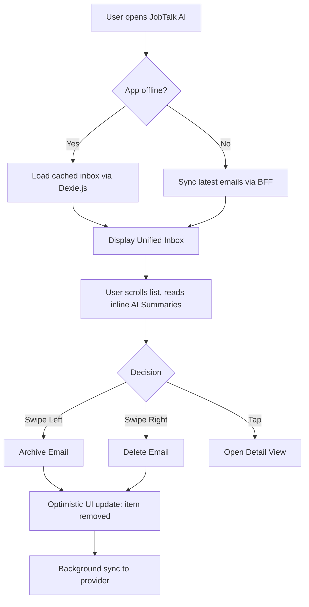
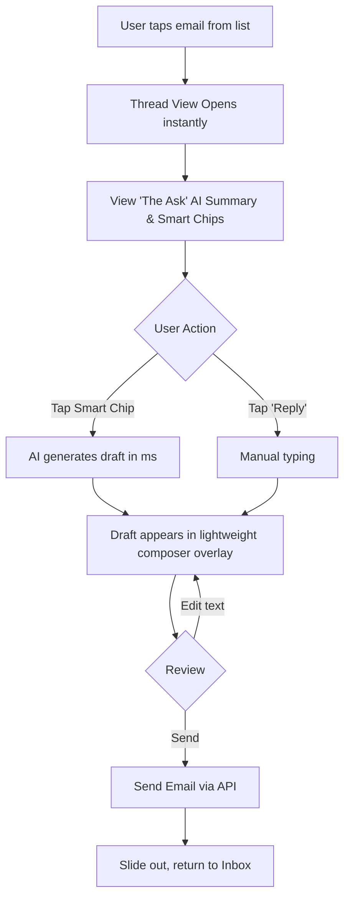

# UX Design Specification JobTalk AI

**Author:** Egor
**Date:** 2026-05-14

---

<!-- UX design content will be appended sequentially through collaborative workflow steps -->

## Executive Summary

### Project Vision

JobTalk AI is a mobile-first, universal email PWA built to reduce "digital janitorial work" for power users. It acts as an AI-powered command center, consolidating Gmail, Office 365, and IMAP into a single, high-performance interface. The focus is strictly on email efficiency—using a local-first architecture for sub-second responsiveness and agentic AI to summarize threads, draft replies, and prioritize the inbox. The solution will be kept simple, lightweight, and strictly aligned with the test task requirements.

### Target Users

**The Solo Power User:** Freelancers, managers, and consultants who juggle 3+ email accounts. They value time and speed above all else. They suffer from the cognitive load of high email volumes and context switching between different provider interfaces. They need a tool that does the heavy lifting of triage so they can focus on high-value communication.

### Key Design Challenges

- **AI Integration Without Clutter:** Displaying AI thread summaries and draft suggestions naturally without overwhelming the core email reading experience.
- **Unified Simplicity:** Creating a clean, cohesive interface that seamlessly merges different email providers (Gmail, O365, IMAP) while keeping navigation lightweight.
- **Mobile-First Triage:** Ensuring that high-frequency actions (archive, delete, reply) are accessible and frictionless on mobile screens, especially for quick triage.

### Design Opportunities

- **Sub-Second "Snappy" Interactions:** Leveraging the local-first architecture to provide instant visual feedback (optimistic UI) for actions like archiving or changing priorities.
- **"Zero-Friction" Reading:** Replacing long email threads with concise, scannable AI summaries ("The Ask" and "Action Items") right at the top of the view.
- **Minimalist Aesthetic:** Stripping away non-essential features (contacts, calendar, tasks) allows for a hyper-focused, distraction-free inbox design.

## Core User Experience

### Defining Experience

The core user experience revolves around hyper-efficient email triage. The defining action is processing the inbox: the user opens an email, instantly reads the AI-generated summary ("The Ask" and "Action Items"), and decides to either archive it, delete it, or use an AI-assisted one-tap reply. This loop must be lightning-fast.

### Platform Strategy

JobTalk AI is a mobile-first Progressive Web App (PWA). It is designed primarily for touch interaction on mobile devices, though it functions cleanly on desktop. A critical requirement is local-first offline support using Dexie.js, ensuring that slow network connections do not interrupt the triage flow. 

### Effortless Interactions

- **Zero-Latency Navigation:** Switching between the unified inbox and specific accounts (Gmail, O365, IMAP) happens instantly without loading spinners.
- **Swipe-to-Triage:** Fluid mobile gestures (swipe left/right) for archiving and deleting.
- **One-Tap Drafts:** Generating a context-aware reply requires a single tap, with the AI handling the heavy lifting of the composition.

### Critical Success Moments

- **The "Ah-Ha" Summary Moment:** When a user opens a convoluted 15-message thread and instantly understands the required action via a 2-sentence AI summary.
- **Offline Triage:** When a user successfully clears their inbox while commuting on a spotty connection, and syncs seamlessly upon reconnection.
- **Instant Launch:** The PWA opens instantly, feeling like a native application rather than a web page.

### Experience Principles

- **Speed is the Ultimate Feature:** No waiting. Optimistic UI updates make every action feel immediate.
- **AI as a Scannable Assistant:** AI summaries should be visually distinct, concise, and sit at the top of the content—never replacing the original email, but providing a fast-track to understanding.
- **One-Handed Mobile Triage:** All core actions must be accessible for one-handed use on a mobile device.

## Desired Emotional Response

### Primary Emotional Goals

- **Empowered and In Control:** The user should feel like they are slicing through their communication backlog with surgical precision. 
- **Calm and Focused:** The app must reduce the anxiety of a crowded inbox by replacing walls of text with clear, actionable AI summaries.

### Emotional Journey Mapping

- **Discovery (First Open):** *Relief.* "Finally, all my accounts in one clean, fast view."
- **Core Action (Triage):** *Flow state.* "I'm clearing these emails effortlessly."
- **Completion (Inbox Zero):** *Accomplishment and peace of mind.*
- **Offline / Spotty Connection:** *Confidence.* "My actions are saved and will sync automatically."

### Micro-Emotions

- **Relief vs. Overwhelm:** Arriving at a 15-message thread and seeing a concise 2-sentence summary provides an immediate micro-dose of relief.
- **Confidence vs. Confusion:** AI draft suggestions must be clearly distinguishable from human-written text so the user confidently knows what they are sending.
- **Delight vs. Satisfaction:** The snappy, zero-latency response of local-first UI updates elevates standard satisfaction into delight.

### Design Implications

- **For Relief:** Strip away unnecessary UI chrome. Use ample whitespace. Highlight AI summaries distinctively (e.g., subtle background tint, distinct typography) but keep them unobtrusive.
- **For Confidence:** Provide clear, immediate "Undo" actions (e.g., a snackbar after archiving) so users aren't afraid to triage at high speed.
- **For Delight:** Implement fluid micro-animations (e.g., smooth swipe-to-archive gestures) that make the interface feel alive and responsive.

### Emotional Design Principles

- **Clarity Over Cleverness:** Power users want to get in and get out. The design should be direct and utilitarian, not overly playful.
- **Trust Through Transparency:** Always make it clear what the AI has generated. Allow easy toggle to the original email if the user doubts the summary.
- **Forgiving Interactions:** High-speed triage requires a safety net. Make destructive actions easily reversible.

## UX Pattern Analysis & Inspiration

### Inspiring Products Analysis

- **Superhuman:** Excels at raw speed and treating email as a triage queue. Its minimalist interface strips away distractions. We will translate its keyboard-first speed into gesture-first speed for our mobile PWA.
- **Shortwave:** Excels at integrating AI naturally. It treats email threads almost like a modern chat interface and places AI summaries inline, making it incredibly easy to catch up on long conversations.
- **Hey Email:** Excels at having "strong opinions" about email. It reduces cognitive load by eliminating traditional folders and focusing purely on what needs attention *now*.

### Transferable UX Patterns

- **Swipe-to-Triage (Interaction):** Standardized, fluid mobile gestures (swipe left to archive, swipe right to delete) that allow users to process lists without opening individual items.
- **Inline AI Cards (Visual/Interaction):** Placing AI-generated summaries at the top of an email thread in a visually distinct "card" (e.g., subtle tint, different border) so it doesn't blend into the human-written text.
- **Bottom Navigation / Action Bar (Navigation):** Keeping primary actions (Compose, Reply, Switch Account) at the bottom of the screen, within easy thumb reach for one-handed mobile use.

### Anti-Patterns to Avoid

- **The "Ribbon" of Buttons:** Cluttering the mobile UI with dozens of icons (Print, Move to Folder, Mark Unread, etc.). We must restrict the UI to only the most critical triage actions.
- **Modal Hell for AI Features:** Forcing the user to click a magic wand icon and wait for a pop-up modal just to read a summary. AI insights must be proactively surfaced inline.
- **Blocking Loading Spinners:** Preventing the user from reading cached emails or taking actions while the app syncs in the background.

### Design Inspiration Strategy

**What to Adopt:**
- Fluid swipe gestures for immediate triage.
- Distinct visual containers for AI summaries and draft suggestions to ensure trust through transparency.

**What to Adapt:**
- Superhuman's "speed above all" philosophy, adapted from desktop keyboard shortcuts to mobile touch gestures and optimistic local-first UI updates.

**What to Avoid:**
- Traditional folder trees and complex manual labeling systems that add cognitive load instead of reducing it.

## Design System Foundation

### 1.1 Design System Choice

**Minimalist Vanilla CSS System** (Custom, lightweight design system utilizing native CSS variables and semantic HTML).

### Rationale for Selection

- **Strict Adherence to Simplicity:** The project mandates a "simple and lightweight efficient solution without overcomplicating logic." Heavy frameworks or utility-first libraries add unnecessary build steps and complexity.
- **Maximum Performance:** Vanilla CSS ensures the smallest possible footprint, contributing directly to our goal of sub-second "Time to Interactive" for the PWA.
- **Agentic Predictability:** AI coding agents (like Claude Code) work exceptionally well with clear, semantic HTML and straightforward CSS variables, reducing hallucinations related to complex utility class combinations or external library APIs.

### Implementation Approach

- **CSS Variables (Custom Properties):** We will define a strict set of design tokens (colors, spacing, typography) in a global `index.css` file.
- **Semantic HTML5:** Relying on native HTML elements (e.g., `<dialog>` for modals, `<button>` for actions) to handle accessibility and core behavior without extra JavaScript.
- **Component-Scoped CSS:** If using a framework like React/Next.js, CSS will be scoped (e.g., CSS Modules) to prevent global namespace pollution while keeping the stack vanilla.

### Customization Strategy

- **Token-Driven Theming:** All visual properties will map back to root CSS variables. This allows for trivial implementation of Dark Mode and easy adjustments to the core brand colors.
- **Micro-Animations via CSS:** Fluid swipe gestures and optimistic UI transitions will be handled via native CSS transitions (`transform`, `opacity`) rather than heavy JavaScript animation libraries.

## 2. Core User Experience

### 2.1 Defining Experience

**"Swipe to clear, tap to reply."** 
The defining experience of JobTalk AI is the ultra-fast triage of incoming mail. Instead of dreading a long thread, the user opens it, instantly reads "The Ask" (a 1-2 sentence AI summary of what is required from them), and immediately takes action using one-tap AI reply chips or a swipe gesture to archive.

### 2.2 User Mental Model

Currently, power users view their inbox as a chaotic, endless to-do list where they must dig through paragraphs of pleasantries to find the actual request. 
Our target mental model shifts this paradigm to: **"The app reads the mail for me and presents only the decisions I need to make."** We want users to stop thinking about "reading emails" and start thinking about "making triage decisions."

### 2.3 Success Criteria

- **Time-to-Triage:** The time to process a complex 10-message thread drops from minutes to under 15 seconds.
- **Trust in AI:** Users frequently archive or reply to emails based *solely* on the AI summary, without feeling the need to read the original body text.
- **Zero Friction:** Navigation between the inbox and individual emails happens with zero perceived loading time (optimistic UI).

### 2.4 Novel UX Patterns

- **Established Patterns:** We rely heavily on familiar mobile paradigms—swipe left/right on list items to archive/delete, and a standard bottom navigation bar.
- **Novel Pattern ("The Ask" Card):** Placing a visually distinct AI summary *above* the email content, combined with predictive "One-Tap Reply" chips (e.g., `[Yes, schedule it]`, `[No, not interested]`). This turns reading into a multiple-choice decision.

### 2.5 Experience Mechanics

**1. Initiation:** 
The user opens the app and sees the unified inbox. High-priority emails (scored by AI) are visually highlighted at the top.
**2. Interaction:** 
The user taps an email. Because of Dexie.js caching, the thread opens instantly. At the top of the screen sits "The Ask" summary box and 2-3 smart reply chips.
**3. Feedback:** 
If the user taps a smart reply chip, the AI instantly generates a full draft. The draft appears in a lightweight composer overlay for quick review, preventing accidental sends but keeping the flow fast.
**4. Completion:** 
The user taps "Send". The composer collapses, a brief "Sent" snackbar appears, and the user is automatically returned to the inbox (or the next unread message) with a fluid slide animation.

## Visual Design Foundation

### Color System

To support a calm, focused, and ultra-fast triage experience, the color palette is high-contrast and minimalist.

- **Backgrounds:** Pure white (`#FFFFFF`) for content cards and very light gray (`#F9FAFB`) for the canvas. For Dark Mode, we use true black (`#000000`) for the canvas (saving battery on OLED mobile screens) and dark gray (`#111827`) for cards.
- **Primary Action:** A confident, energetic "Electric Blue" or "Deep Indigo" (e.g., `#4F46E5`) for primary buttons and active states.
- **AI Accent:** A subtle "Magic Purple" (e.g., `#8B5CF6`) or a soft gradient used *exclusively* for AI-generated summaries and smart chips, establishing immediate visual trust.
- **Semantic/Utility:** Muted red for destructive actions (Delete) to clearly communicate intent without causing panic.

### Typography System

To ensure zero-latency loading and maximum readability, we will rely on **System Native Fonts** (`-apple-system, BlinkMacSystemFont, "Segoe UI", Roboto, sans-serif`). 

- **Hierarchy:** 
  - *Primary (The Ask):* 18px-20px, Medium or Semi-Bold weight. It must grab attention instantly.
  - *Secondary (Email Body):* 16px base size for maximum legibility on mobile, with a relaxed line-height (1.5).
  - *Metadata (Time, Sender info):* 13px-14px, subdued gray color.

### Spacing & Layout Foundation

- **Base Grid:** A standard 4px/8px spacing system using CSS variables (`--space-1`, `--space-2`, etc.).
- **Density:** Airy and spacious. The goal is to reduce cognitive load, so we will use generous padding (e.g., 16px or 24px) between distinct structural elements (like separating the AI summary from the original email body).
- **Layout:** Strictly mobile-first. A single-column view with bottom-anchored action bars, ensuring that primary actions (Compose, Reply, Switch Accounts) are always within thumb's reach for one-handed use.

### Accessibility Considerations

- **Contrast:** All text colors must pass WCAG 2.1 AA contrast minimums (4.5:1 for normal text). The AI accent colors must be carefully tuned to ensure they remain legible against both light and dark backgrounds.
- **Touch Targets:** Minimum 44x44px hit areas for all interactive elements (swipes, chips, buttons) to ensure effortless mobile triage without "fat-finger" errors.

## Design Direction Decision

### Design Directions Explored

We explored three primary visual directions in our HTML showcase:
1. **"Triage List"**: Injects AI summaries directly into the inbox list view.
2. **"The Ask" (Detail)**: Places a prominent AI summary card with one-tap action chips above the email body.
3. **"Chat-Style Threads"**: Presents long threads in a modern messaging app format.

### Chosen Direction

**Hybrid Approach: "Triage List" + "The Ask" Detail View**
We will combine Direction 1 (for the main inbox view) and Direction 2 (for the individual email view). This provides maximum triage speed while preserving the ability to read details when necessary.

### Design Rationale

- **Maximum Triage Speed:** Seeing summaries directly in the list (Direction 1) allows users to swipe-archive without even opening the email.
- **Action-Oriented Detail:** When an email *does* need to be opened, "The Ask" card (Direction 2) immediately presents the user with smart reply options, eliminating the need to type out routine responses.

### Implementation Approach

- **Component Reusability:** The `ai-summary-inline` component will be built to scale seamlessly between the list view and the detail view.
- **CSS Grid/Flexbox:** Layouts will be built using modern CSS layout techniques to ensure the mobile frames scale perfectly across different device widths.

## User Journey Flows

### Inbox Triage (List View)

This flow focuses on the hyper-efficient processing of the inbox without opening individual emails. The user relies on inline AI summaries to make immediate swipe decisions.

### Email Detail & AI Reply

When an email requires a response or more context, the user enters the detail view. The flow is optimized to turn reading into a quick multiple-choice decision using AI.

### Journey Patterns

- **Optimistic UI (Feedback Pattern):** Every destructive action (Archive, Delete) and every state change updates the UI immediately. Server synchronization happens silently in the background.
- **Predictive Branching (Decision Pattern):** Instead of giving the user a blank text box, we provide 2-3 predictive branches (Smart Chips) to guide their decision.

### Flow Optimization Principles

- **Zero-Step Value:** The moment the app opens, the user receives value (cached inbox is immediately visible).
- **Error Recovery:** If a user accidentally swipes to archive, a 3-second snackbar allows them to "Undo" before the background sync finalizes the action.

## Component Strategy

### Design System Components (Semantic Foundation)

Because we chose a Minimalist Vanilla CSS approach, our foundational components rely on native browser capabilities styled with our CSS variables:
- **Dialogs & Overlays:** Native HTML `<dialog>` element.
- **Inputs & Forms:** Native `<input>` and `<textarea>`.
- **Navigation:** Semantic `<nav>` and bottom-fixed action bars.
- **Typography:** Semantic headings (`<h1>` to `<h4>`) and paragraphs (`
`).

### Custom Components

To support our unique AI-first triage flow, we must build the following custom components:

#### 1. SwipeableEmailListItem
**Purpose:** Display email previews in the inbox and handle the core "Swipe-to-Triage" interactions.
**Anatomy:** Sender, Subject, inline AI summary snippet, relative time. Hidden action panels (Archive/Delete) beneath the item.
**Interaction Behavior:** Swipe left reveals Archive action; swipe right reveals Delete action. Tap opens the email thread.
**Accessibility:** Must include visually hidden buttons for screen readers to trigger Archive/Delete actions without swiping.

#### 2. AISummaryCard ("The Ask")
**Purpose:** Proactively surface the core request and action items at the top of an open email thread.
**Anatomy:** Distinctive container (subtle purple tint/border), "Sparkle" AI icon, Title, 1-2 sentence body text.
**States:** Loading (shimmer effect while generating), Complete, Error.

#### 3. SmartReplyChip
**Purpose:** Provide predictive branching options to trigger one-tap AI draft generation.
**Anatomy:** Pill-shaped button styled with the AI Accent color.
**States:** Default, Active (pressed), Loading (small spinner while AI generates draft).

#### 4. LightweightComposer
**Purpose:** A fast overlay for reviewing and sending AI-generated drafts.
**Anatomy:** Form container that slides up from the bottom, editable text area, Send button, Discard button.
**Interaction Behavior:** Automatically focuses the text area when opened. Slides out smoothly upon sending.

### Component Implementation Strategy

- **CSS Variables First:** All components will rigidly adhere to the color and spacing tokens defined in our Visual Foundation. No hardcoded hex values.
- **Micro-Animations via CSS:** Swipe gestures and composer slide-ins will utilize native CSS `transform` and `transition` for 60fps performance without JavaScript animation libraries.
- **Accessibility as Default:** All interactive components will have a minimum touch target of 44x44px and proper `aria-labels` for state changes.

### Implementation Roadmap

**Phase 1 - Core Triage:**
- Base Typography & Color CSS variables setup.
- `SwipeableEmailListItem` and native Bottom Navigation.
*(Unlocks the basic inbox viewing and manual triage experience).*

**Phase 2 - AI Integration:**
- `AISummaryCard` (inline and detail views).
- `SmartReplyChip`.
*(Unlocks the core value proposition of AI reading/understanding).*

**Phase 3 - Completion Flows:**
- `LightweightComposer`.
- Global Snackbar/Toast component for "Undo" functionality.
*(Unlocks sending emails and error recovery).*

## UX Consistency Patterns

### Button Hierarchy

To prevent decision fatigue, every view must have a strict hierarchy of actions:
- **Primary Action (Solid Primary Color):** Reserved for final, high-commitment actions (e.g., "Send", "Sign In"). Maximum one per screen.
- **Smart Chips (Pill shape, AI Accent Color):** Contextual, predictive AI actions (e.g., "Reply: Yes"). These are given visual prominence but sit below the primary action in hierarchy.
- **Secondary Action (Outline/Tinted):** Alternative actions that don't drive the main flow.
- **Tertiary Action (Ghost/Text-only):** Low-commitment actions like "Cancel" or "Discard".

### Feedback Patterns

Speed requires trust, and trust requires immediate feedback:
- **Optimistic Updates:** All destructive/triage actions (Archive, Delete) remove the item from the UI instantly. We do NOT use blocking confirmation modals (e.g., "Are you sure?"). 
- **Undo Mechanism:** Instead of confirmations, we use a 3-5 second Snackbar that slides up from the bottom containing an "Undo" button.
- **AI Loading State:** When the AI is generating a draft or summary, we use a subtle, non-blocking *shimmer effect* on the target component rather than a full-screen loading spinner.
- **Errors:** Handled via inline red text (for forms) or a persistent red snackbar (for network failures).

### Form Patterns

Forms in JobTalk AI are minimal, primarily consisting of the Login view and the Email Composer:
- **Auto-Focus:** When a composer or search view opens, the primary input field is automatically focused, bringing up the mobile keyboard instantly.
- **Auto-Expanding Textareas:** The email composer text area grows vertically as the user types, eliminating inner scrollbars and keeping the content visible.

### Navigation Patterns

- **Bottom Navigation Bar:** The primary mechanism for switching between root views (Inbox, Search, Settings). It remains persistent across the main app.
- **Stack Navigation:** Moving from the Inbox to an Email Detail view uses a native-feeling "Slide In" transition from the right. A prominent "Back" arrow is always available in the top-left header.

### Swipe Patterns

- **Thresholds:** A swipe must cross a 40% screen-width threshold to trigger an action automatically.
- **Visual Cues:** As the user swipes, the background reveals the action color (e.g., Red for Delete, Green for Archive) and an icon, growing in opacity.

## Responsive Design & Accessibility

### Responsive Strategy

Since the project mandate is a "mobile-ready PWA" and requires a lightweight MVP, our strategy is strictly **Mobile-First**. 
- **Mobile:** The primary target. Single-column list view, bottom navigation, and gesture-driven triage (swipes).
- **Tablet & Desktop:** Instead of building complex multi-pane layouts (which would violate the "keep it simple" rule), the app will scale up gracefully by centering a maximum-width content column (e.g., 600px wide, similar to Telegram Web or Twitter). This preserves the focus and speed of the mobile triage experience on larger screens.

### Breakpoint Strategy

We will use a simplified breakpoint strategy to keep CSS minimal:
- **Mobile (`< 768px`):** 100% width, fixed bottom navigation bar.
- **Desktop/Tablet (`>= 768px`):** Container constrained to `max-width: 600px`, centered on the screen. The navigation can move to a sticky top header or remain at the bottom of the container.

### Accessibility Strategy

We target **WCAG 2.1 AA** compliance to ensure the app is usable by everyone without adding unnecessary engineering overhead.
- **Touch Alternatives:** Swipe gestures (Archive/Delete) are inherently inaccessible to some users. We will ensure screen readers can access visually hidden "Archive" and "Delete" buttons within each `EmailListItem`.
- **Contrast:** The AI "Magic Purple" accent color must be carefully calibrated to ensure a minimum 4.5:1 contrast ratio against both light and dark mode backgrounds.
- **Focus States:** Every interactive element must have a clear `:focus-visible` state for keyboard navigation.

### Testing Strategy

- **Lighthouse PWA & A11y:** We will rely on Google Chrome's Lighthouse to validate PWA installation criteria and baseline accessibility scores automatically.
- **Mobile Simulation:** Manual testing of swipe thresholds and touch target sizes (minimum 44x44px) using Chrome DevTools device mode.

### Implementation Guidelines

- **Relative Units:** Use `rem` for all typography to respect the user's OS-level text size preferences.
- **Semantic HTML:** Rely heavily on native elements (`<button>`, `<nav>`, `<dialog>`) to get baseline accessibility "for free" without complex ARIA roles.
- **Aria-Labels:** Ensure all icon-only buttons (e.g., Back arrows, Icon-only Smart Chips) have descriptive `aria-label` attributes.
